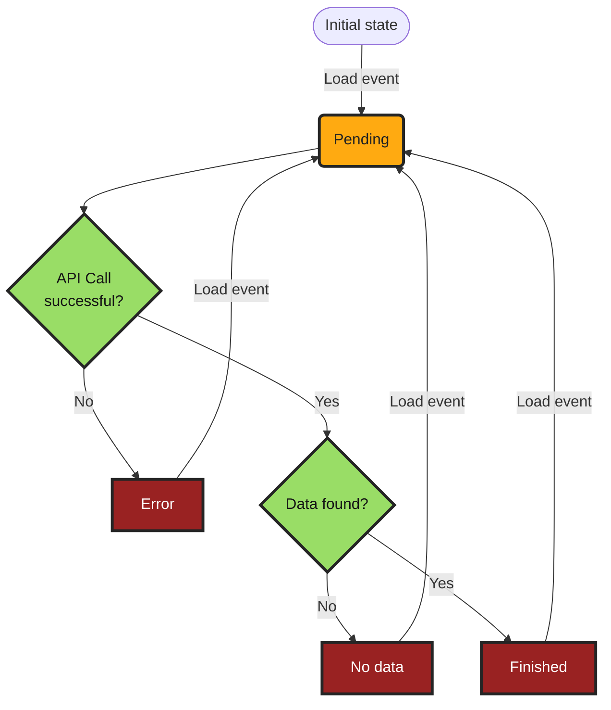

# Generic Store

`Generic store` and the accompanying `Generic API Client` try to hide the 
complexity of handling of API calls and exposing store to components, using 
`BehaviourSubject` observables.

## Loading Status

Call state enum has 5 values:
```
export enum CallState {
  Initial = 'INITIAL',
  Pending = 'PENDING',
  Finished = 'FINISHED',
  Failed = 'FAILED',
  NoData = 'NODATA'
}

```
- **Pending** is a transient state, while the API call is in progress 
- **Error**, **No data** and **Finished** are terminal states
- Currently the only event available is **loading event**



